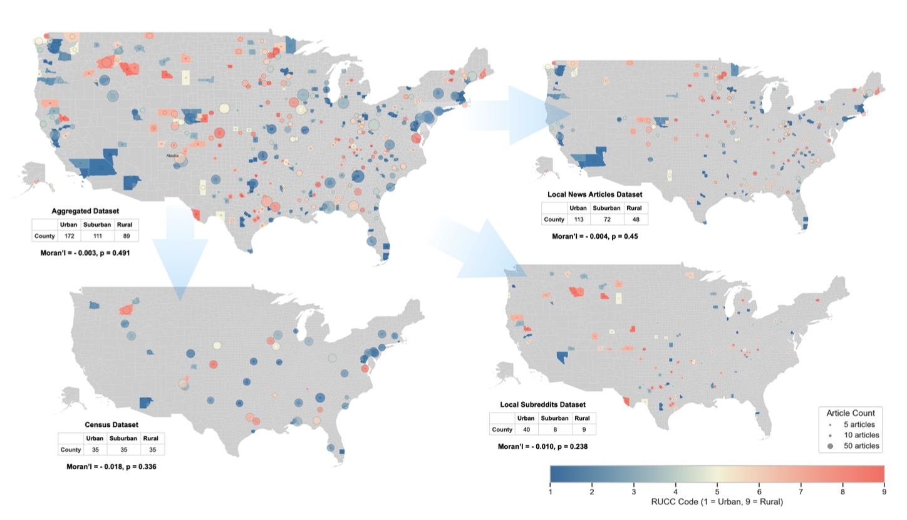
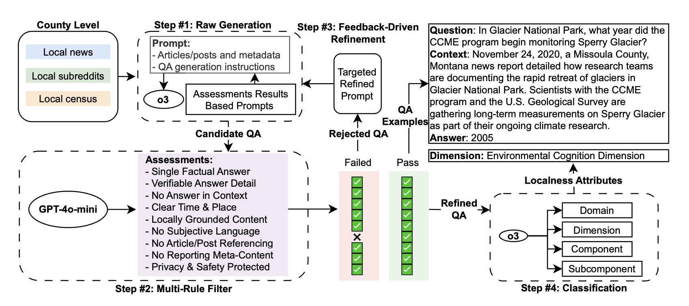
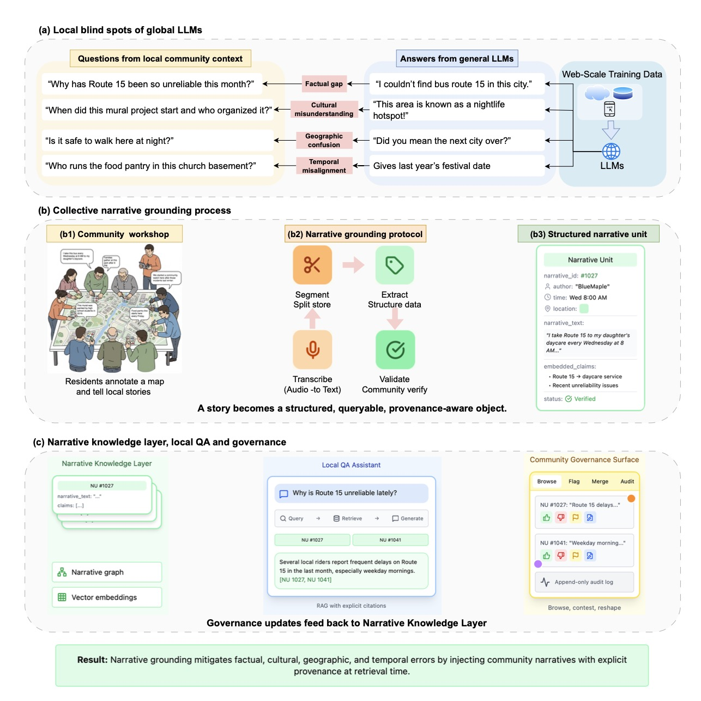
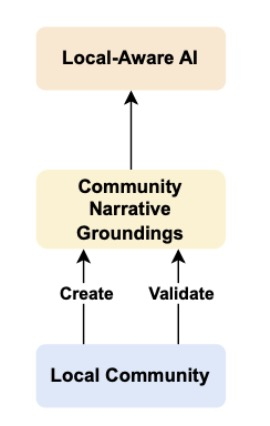
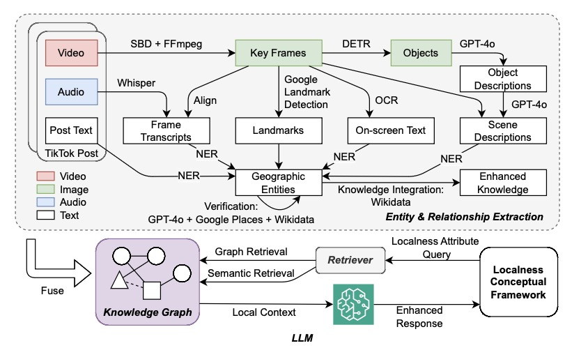
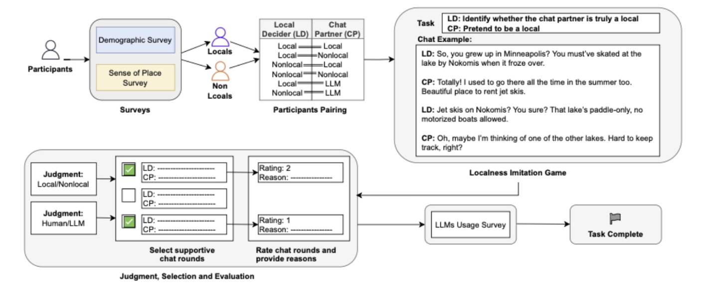
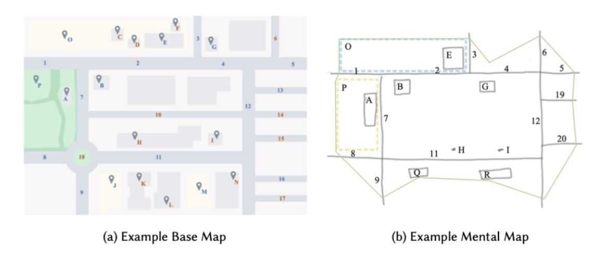
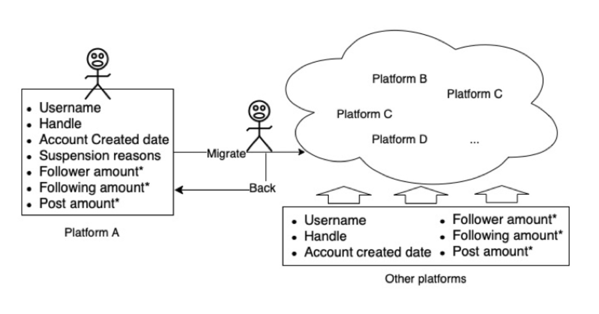
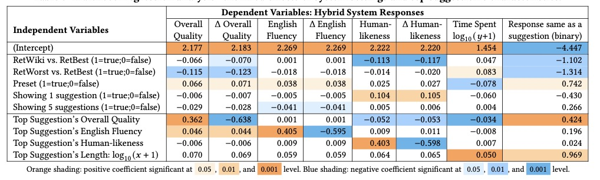
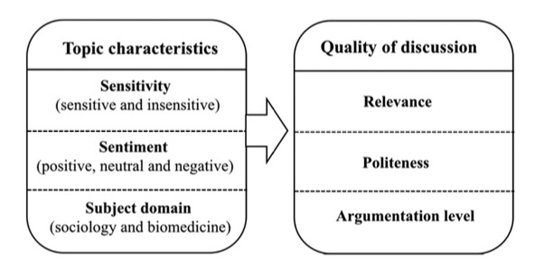

## About me

I am a 5th-year Ph.D. candidate in Information Science at the University of Wisconsin-Madison, advised by [Dr. Jacob Thebault-Spieker](https://jacob.thebault-spieker.com). My research is at the intersection of Human-AI Interaction and Location-based Computing, with a current focus on LLM alignment and mitigating geographic bias in generative models [[NeurIPS '25 Workshop]](#)[[AAAI '26]](#)[[CSCW'26]](#). My background includes building and evaluating human-AI collaborative systems [[CIKM '21]](https://zihanngao.github.io/assets/papers/cikm21_hybrid_chatbot.pdf), modeling user behavior [[CSCW '24a]](https://dl.acm.org/doi/10.1145/3687042)[[CSCW '24b]](https://dl.acm.org/doi/10.1145/3637356), and developing computational systems for understanding "localness" [[Preprint]](https://arxiv.org/pdf/2505.07282)[[CSCW '25 Companion]](https://zihanngao.github.io/assets/papers/tiktok_cscw2025.pdf)[1 work in submission]. Prior to UW-Madison, I received my B.S. in Information Science and Psychology from Peking University, where I researched online discussion quality with [Dr. Pengyi Zhang](https://scholar.google.com/citations?user=fL6FUdkAAAAJ&hl=en) [[ASIS&T '21]](https://zihanngao.github.io/assets/posters/poster_1.pdf).

### 🚀 I am on the Job Market (2026): Seeking both Academia and Industry roles. I'd love to chat about my work on local AI and potential opportunities 👉 [✉️](mailto:zihan.gao@wisc.edu?subject=Job%20market%20chat&body=Hi%20Zihan%2C%0A%0A...).
 

## Publications/Preprints

  
  

    
<strong>Is Your Chatbot a Tourist or a Townie? Quantifying Geographic and Localness Disparities in LLM Representations of Place</strong>

    
<strong>Zihan Gao</strong>, Jacob Thebault-Spieker

    
ACM CSCW 2026

    
<a href="https://zihanngao.github.io/assets/papers/cscw2026.pdf" target="_blank" rel="noopener noreferrer">PDF</a>

  

  
  

    
<strong>LocalBench: Benchmarking LLMs on County-Level Local Knowledge and Reasoning</strong>

    
<strong>Zihan Gao</strong>, Yifei Xu, Jacob Thebault-Spieker

    
AAAI 2026

    
<a href="https://arxiv.org/pdf/2511.10459" target="_blank" rel="noopener noreferrer">PDF</a>

  

  
  

    
<strong>Collective Narrative Grounding: Community-Coordinated Data Contributions to Improve Local AI Systems</strong>

    
<strong>Zihan Gao*</strong>, Mohsin Yar Khan Yousufi*, Jacob Thebault-Spieker

    
NeurIPS 2025 Workshop on Algorithmic Collective Action

    
<a href="https://openreview.net/pdf?id=2ZRwKlGSDa" target="_blank" rel="noopener noreferrer">PDF</a> <a href="https://zihanngao.github.io/assets/posters/nips2025_poster.pdf" target="_blank" rel="noopener noreferrer">Poster</a>

  

  
  

    
<strong>From Fact-Checking to Narrative Grounding: Toward Local Narrative Infrastructures for Epistemic Justice</strong>

    
<strong>Zihan Gao</strong>, Jacob Thebault-Spieker

    
ACM CSCW 2025 Workshop on Beyond Information

    
<a href="https://zihanngao.github.io/assets/papers/CSCW2025b.pdf" target="_blank" rel="noopener noreferrer">PDF</a>

  

  
  

    
<strong>From Clips to Communities: Fusing Social Video into Knowledge Graphs for Localness-Aware LLMs</strong>

    
<strong>Zihan Gao</strong>, Jiaying "Lizzy" Liu, Yifei Xu, Jacob Thebault-Spieker

    
ACM CSCW 2025 Companion 

    
<a href="https://dl.acm.org/doi/epdf/10.1145/3715070.3749277" target="_blank" rel="noopener noreferrer">PDF</a>

  

  
  

    
<strong>A Turing Test for ''Localness'': Conceptualizing, Defining, and Recognizing Localness in People and Machines</strong>

    
<strong>Zihan Gao</strong>, Justin Cranshaw, Jacob Thebault-Spieker

    
Preprint

    
<a href="https://arxiv.org/pdf/2505.07282" target="_blank" rel="noopener noreferrer">PDF</a>

  

  
  

    
<strong>Journeying Through Sense of Place with Mental Maps: Characterizing Changing Spatial Understanding and Sense of Place During Migration for Work</strong>

    
<strong>Zihan Gao</strong>, Justin Cranshaw, Jacob Thebault-Spieker

    
ACM CSCW 2024

    
<a href="https://dl.acm.org/doi/10.1145/3687042" target="_blank" rel="noopener noreferrer">PDF</a>

  

  
  

    
<strong>Investigating Influential Users' Responses to Permanent Suspension on Social Media</strong>

    
<strong>Zihan Gao</strong>, Jacob Thebault-Spieker

    
ACM CSCW 2024

    
<a href="https://dl.acm.org/doi/10.1145/3637356" target="_blank" rel="noopener noreferrer">PDF</a>

  

  
  

    
<strong>Evaluating Human-AI Hybrid Conversational Systems with Chatbot Message Suggestions</strong>

    
<strong>Zihan Gao</strong>, Jiepu Jiang

    
ACM CIKM 2021

    
<a href="https://dl.acm.org/doi/epdf/10.1145/3459637.3482340" target="_blank" rel="noopener noreferrer">PDF</a>

  

  
  

    
<strong>Exploring How Topic Characteristics Influence Online Discussion Quality</strong>

    
Jieli Liu, <strong>Zihan Gao</strong>, Pengyi Zhang

    
ASIS&T 2021

    
<a href="https://zihanngao.github.io/assets/posters/poster_1.pdf" target="_blank" rel="noopener noreferrer">PDF</a>

  

\* co-first author

## Teaching
TA in UW-Madison IS Dept since 2022, courses include:  
LIS 461 - Data and Algorithms: Ethics and Policy  
CS472/272/LIS472 - Introduction to Web Development  
